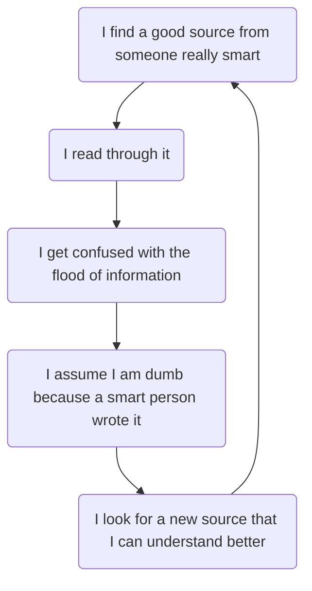

# Background

Whenver I am looking up machine learning related topics and come across a blog/source/medium post, my first thought is "should I trust this person". The answer is usually yes, because there truly are so many smart people out there helping to educate the ML community. However, my curiosity typically feeds into a negative feed back loop that goes something like: 

I talk a little bit more about this in my [post]() about imposter syndrome, but I think for people who experience this or something similar its important to say a couple things upfront: 
- **I definitely could have done a better job explaining all the concepts I am going over.**
- **In making these blog posts, I start by looking up a whole bunch of things**
- **I am not an expert, just someone who is really likes ML and learning**
- **I get things wrong all the time**
- **If you are confused by blogs/explanations, don't be so quick to blame yourself** 

I don't know to what extent other blog-posters feel this, but I thought it was important to mention. If you have any questions/feedback please feel free to message me on any social media platform, I really do want to help. 

In an effort of full transparency, here's a little backstory on me and how I got to this point. If you are more motivated by the "what have you actually done" part, check out my [resume](https://esoba.github.io/assets/pdf/Soba_Elijah_Resume.pdf). 

## Backstory

In college, I started out as a Biomedical Engineer. I loved math coming out of highschool, and chose Biomedical engineering because engineering = lot of math and biomedical = make an impact on human life. Some people know what their life's calling is at 18, but I was not one of those people. I just wanted to do something I found relatively interesting.

> Reflecting back on this, it's crazy to think I was prepared to go into hefty amounts of debt to pursue something essentially based on vibes. There is so much I would discuss with my younger self, but thats a entire blog post itself!

During junior year, I was stuck without a job/internship after endless applications, and losing hope that I would be able to find something meaningful and fulfilling. I went to an advisor to seek out some guidance, and a piece of our conversation really stuck out to me. 

> "Companies don't want a jack of all trades. If you know a little bit about electrical and a little bit about chemistry chances are they'll take an expert and teach them what they need to know otherwise." 

Although I understood the sentiment, my immediate thought was "That's pretty dumb". In such a small conversation, I felt like my 3 years of school (up to that point) had been useless. Philosophically, I didn't agree, but at the time it was something I needed to hear. I wanted to pursue something that would cherish my curiosity and willingness to learn, not punish it. This was a turning point that kickstarted me learning ML. 

Coincidentally, all of this happened around the same time as the COVID pandemic which presented me with a unique opportunity. I very vaguely knew about ML because of a signal processing class and design project I was apart of, and started learning more about it in my down time (which at the point in the lockdown was my entire day). After figuring out that ML wasn't actually magical computer science, but just hardcore math programmed to be run on a computer, I was hooked.

Machine Learning, by design, rewards you for being a jack of all trades. It's a gigantic combination of statistics, probability, linear algebra, computer science, etc. It was exactly what I was looking for: rigorous, constantly evolving, and multifaceted. I don't think I was ever as motivated to learn something as I was towards machine learning during the lockdown. I self-studied as much as I could during that time, decided Biomedical Engineering was no longer for me, and never looked back. 

Sometimes, there are certain decisions you make and risks you take that unknowingly have a huge impact on your life: this was one of them. I finished out my Biomedical Degree almost as a consolation prize for how far I had already made it, and pursued a Masters in Machine Learning shortly after. I got experience teaching, researching, and working in the field and I can still confidently say it is something I want to continue to be apart of. All of this led me here, writing a blog that hopefully will be able to help others share my journey and passion for ML.  

